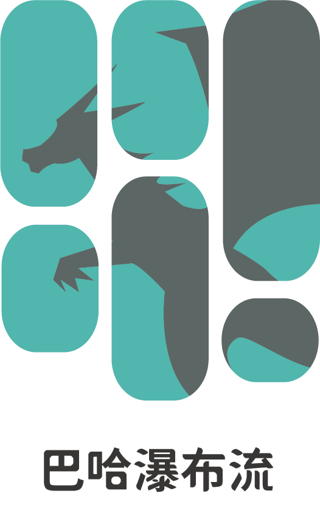

[![Contributors][contributors-shield]][contributors-url]
[![Forks][forks-shield]][forks-url]
[![Stargazers][stars-shield]][stars-url]
[![Issues][issues-shield]][issues-url]
[![MIT License][license-shield]][license-url]
[![LinkedIn][linkedin-shield]][linkedin-url]

 

  

  <h3 align="center">巴哈瀑布流 - 場外休憩區閱覽器</h3>

  

    <a href="https://github.com/determinationlove/Baha_MasonryLayout"><strong>Explore the docs »</strong></a>
     
     
    <a href="https://github.com/determinationlove/Baha_MasonryLayout">View Demo</a>
    ·
    <a href="https://github.com/determinationlove/Baha_MasonryLayout/issues">Report Bug</a>
    ·
    <a href="https://github.com/determinationlove/Baha_MasonryLayout/issues">Request Feature</a>
  

<!-- MARKDOWN LINKS & IMAGES -->
<!-- https://www.markdownguide.org/basic-syntax/#reference-style-links -->
[contributors-shield]: https://img.shields.io/github/contributors/determinationlove/Baha_MasonryLayout.svg?style=for-the-badge
[contributors-url]: https://github.com/determinationlove/Baha_MasonryLayout/graphs/contributors
[forks-shield]: https://img.shields.io/github/forks/determinationlove/Baha_MasonryLayout.svg?style=for-the-badge
[forks-url]: https://github.com/determinationlove/Baha_MasonryLayout/network/members
[stars-shield]: https://img.shields.io/github/stars/determinationlove/Baha_MasonryLayout.svg?style=for-the-badge
[stars-url]: https://github.com/determinationlove/Baha_MasonryLayout/stargazers
[issues-shield]: https://img.shields.io/github/issues/determinationlove/Baha_MasonryLayout.svg?style=for-the-badge
[issues-url]: https://github.com/determinationlove/Baha_MasonryLayout/issues
[license-shield]: https://img.shields.io/github/license/determinationlove/Baha_MasonryLayout.svg?style=for-the-badge
[license-url]: https://github.com/determinationlove/Baha_MasonryLayout/blob/master/LICENSE.txt
[linkedin-shield]: https://img.shields.io/badge/-LinkedIn-black.svg?style=for-the-badge&logo=linkedin&colorB=555
[linkedin-url]: www.linkedin.com/in/幽冥-燐火-a08229237
[product-screenshot]: images/screenshot.png
[Next.js]: https://img.shields.io/badge/next.js-000000?style=for-the-badge&logo=nextdotjs&logoColor=white
[Next-url]: https://nextjs.org/
[React.js]: https://img.shields.io/badge/React-20232A?style=for-the-badge&logo=react&logoColor=61DAFB
[React-url]: https://reactjs.org/
[Vue.js]: https://img.shields.io/badge/Vue.js-35495E?style=for-the-badge&logo=vuedotjs&logoColor=4FC08D
[Vue-url]: https://vuejs.org/
[Angular.io]: https://img.shields.io/badge/Angular-DD0031?style=for-the-badge&logo=angular&logoColor=white
[Angular-url]: https://angular.io/
[Svelte.dev]: https://img.shields.io/badge/Svelte-4A4A55?style=for-the-badge&logo=svelte&logoColor=FF3E00
[Svelte-url]: https://svelte.dev/
[Laravel.com]: https://img.shields.io/badge/Laravel-FF2D20?style=for-the-badge&logo=laravel&logoColor=white
[Laravel-url]: https://laravel.com
[Bootstrap.com]: https://img.shields.io/badge/Bootstrap-563D7C?style=for-the-badge&logo=bootstrap&logoColor=white
[Bootstrap-url]: https://getbootstrap.com
[JQuery.com]: https://img.shields.io/badge/jQuery-0769AD?style=for-the-badge&logo=jquery&logoColor=white
[JQuery-url]: https://jquery.com 
